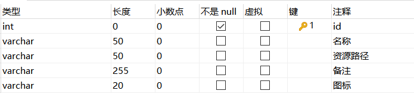
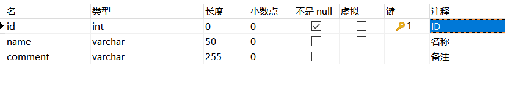
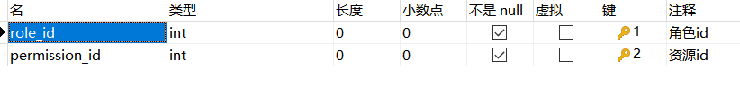
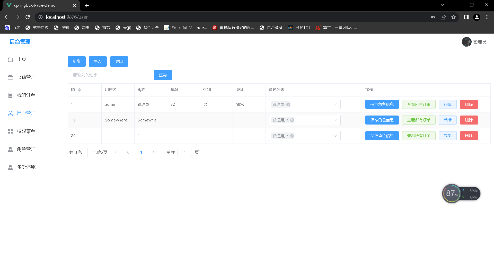
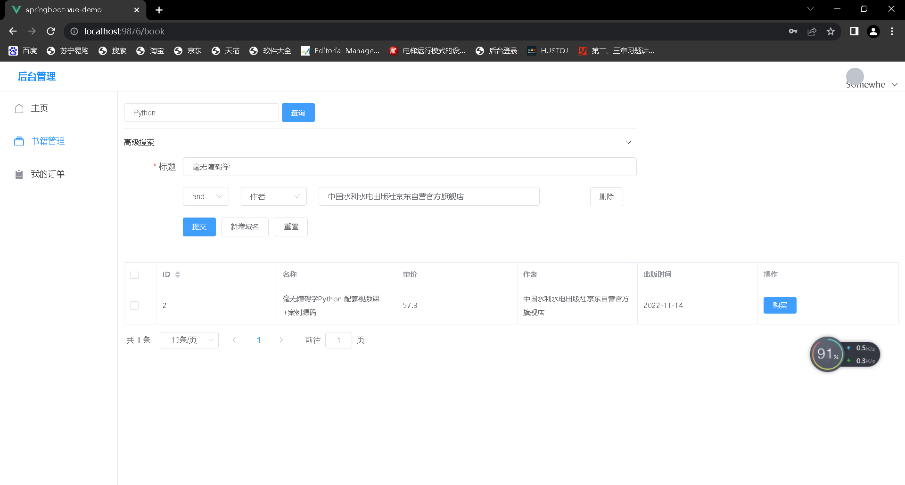
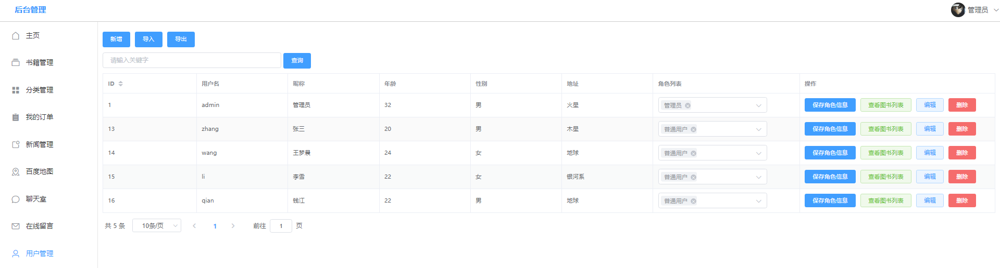
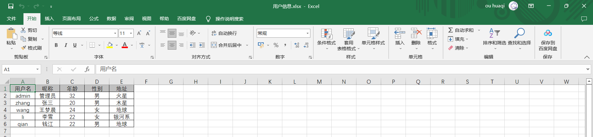
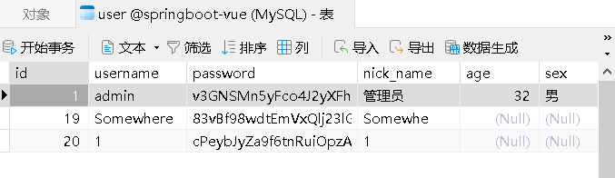

# 软工导论期末项目demo

## 五大功能

- 权限控制
- 数据源备份还原
- 高级搜索
- 报表输出
- 密码加密

-----------------

### 权限控制

##### 	分配权限思路

分配权限前需要显示当前角色拥有的权限信息，被分配角色的权限信息，不能超出当前用户所拥有的权限信息。

1. 查询当前用户登入信息
2. 判断当前登入用户是否是管理员，如果是管理员，则查询所有权限信息；如果不是管理员，则需要根据当前用户id查询当前用户所拥有的权限信息
3. 构建权限的数据库，存放其id编号、页面名称、页面路径、备注及页面图标等信息。同时构建角色的数据库，将权限数据库与角色数据相关联，达到权限控制的目的
4. 查询要分配角色拥有的权限列表，进行数据显示
5. 保存角色权限关系时，需要删除该角色原有的权限信息，再保存新的权限信息。

##### 权限控制实现

- 数据库构建

  1. 权限表 permission

     

  2. 角色表 role

     

  3. 角色-权限表role_permission

     

- Springboot搭建

  1. Permission-Entity

     ```java
     @TableName("permission")
     @Data
     public class Permission {
         @TableId(type = IdType.AUTO)
         private Integer id;
         private String name;
         private String path;
         private String comment;
         private String icon;
     
         @Override
         public boolean equals(Object o) {
             if (this == o) return true;
             if (o == null || getClass() != o.getClass()) return false;
             Permission that = (Permission) o;
             return path.equals(that.path);
         }
     
         @Override
         public int hashCode() {
             return Objects.hash(path);
         }
     ```

  2. PermissionController

     ```java
     @RestController
     @RequestMapping("/permission")
     public class PermissionController extends BaseController {
     
         @Resource
         PermissionMapper PermissionMapper;
     
         @PostMapping
         public Result<?> save(@RequestBody Permission Permission) {
             PermissionMapper.insert(Permission);
             return Result.success();
         }
     
         @PutMapping
         public Result<?> update(@RequestBody Permission Permission) {
             PermissionMapper.updateById(Permission);
             return Result.success();
         }
     
         @DeleteMapping("/{id}")
         public Result<?> update(@PathVariable Long id) {
             PermissionMapper.deleteById(id);
             return Result.success();
         }
     
         @GetMapping("/{id}")
         public Result<?> getById(@PathVariable Long id) {
             return Result.success(PermissionMapper.selectById(id));
         }
     
         @GetMapping("/all")
         public Result<?> all() {
             return Result.success(PermissionMapper.selectList(null));
         }
     
         @GetMapping
         public Result<?> findPage(@RequestParam(defaultValue = "1") Integer pageNum,
                                   @RequestParam(defaultValue = "10") Integer pageSize,
                                   @RequestParam(defaultValue = "") String search) {
             LambdaQueryWrapper<Permission> wrapper = Wrappers.lambdaQuery();
             if (StrUtil.isNotBlank(search)) {
                 wrapper.like(Permission::getName, search);
             }
             Page<Permission> PermissionPage = PermissionMapper.selectPage(new Page<>(pageNum, pageSize), wrapper);
             return Result.success(PermissionPage);
         }
     ```

  3. PermissionMapper

     ```java
     public interface PermissionMapper extends BaseMapper<Permission> {
     
         @Select("select * from role_permission where role_id = #{roleId}")
         List<RolePermission> getRolePermissionByRoleId(Integer roleId);
     
         @Delete("delete from role_permission where role_id = #{roleId}")
         void deletePermissionsByRoleId(Integer roleId);
     
         @Insert("insert into role_permission(role_id, permission_id) values(#{roleId}, #{permissionId})")
         void insertRoleAndPermission(@Param("roleId") Integer roleId, @Param("permissionId") Integer permissionId);
     
     }
     ```

- Vue搭建

  1. 权限控制页面实现

     ```vue
     <template>
       <div style="padding: 10px">
         <!--    功能区域-->
         <div style="margin: 10px 0">
           <el-button type="primary" @click="add">新增</el-button>
         </div>
     
         <!--    搜索区域-->
         <div style="margin: 10px 0">
           <el-input v-model="search" placeholder="请输入关键字" style="width: 20%" clearable></el-input>
           <el-button type="primary" style="margin-left: 5px" @click="load">查询</el-button>
         </div>
         <el-table
             v-loading="loading"
             :data="tableData"
             border
             stripe
             style="width: 100%">
           <el-table-column
               prop="id"
               label="ID"
               sortable
               width="80"
           >
           </el-table-column>
           <el-table-column
               prop="name"
               label="名称">
           </el-table-column>
           <el-table-column
               prop="path"
               label="路径">
           </el-table-column>
           <el-table-column
               prop="comment"
               label="备注">
           </el-table-column>
           <el-table-column
               prop="icon"
               label="图标">
           </el-table-column>
           <el-table-column label="操作">
             <template #default="scope">
               <el-button size="mini" @click="handleEdit(scope.row)">编辑</el-button>
               <el-popconfirm title="确定删除吗？" @confirm="handleDelete(scope.row.id)">
                 <template #reference>
                   <el-button size="mini" type="danger">删除</el-button>
                 </template>
               </el-popconfirm>
             </template>
           </el-table-column>
         </el-table>
     
         <div style="margin: 10px 0">
           <el-pagination
               @size-change="handleSizeChange"
               @current-change="handleCurrentChange"
               :current-page="currentPage"
               :page-sizes="[5, 10, 20]"
               :page-size="pageSize"
               layout="total, sizes, prev, pager, next, jumper"
               :total="total">
           </el-pagination>
         </div>
     
         <el-dialog title="提示" v-model="dialogVisible" width="30%">
           <el-form :model="form" label-width="120px">
             <el-form-item label="名称">
               <el-input v-model="form.name" style="width: 80%"></el-input>
             </el-form-item>
             <el-form-item label="路径">
               <el-input v-model="form.path" style="width: 80%"></el-input>
             </el-form-item>
             <el-form-item label="备注">
               <el-input v-model="form.comment" style="width: 80%"></el-input>
             </el-form-item>
             <el-form-item label="图标">
               <el-input v-model="form.icon" style="width: 80%"></el-input>
             </el-form-item>
           </el-form>
           <template #footer>
               <span class="dialog-footer">
                 <el-button @click="dialogVisible = false">取 消</el-button>
                 <el-button type="primary" @click="save">确 定</el-button>
               </span>
           </template>
         </el-dialog>
     
       </div>
     </template>
     
     <script>
     
     import request from "@/utils/request";
     
     export default {
       name: 'Permission',
       components: {},
       data() {
         return {
           loading: true,
           form: {},
           dialogVisible: false,
           search: '',
           currentPage: 1,
           pageSize: 10,
           total: 0,
           tableData: [],
         }
       },
       created() {
         this.load()
       },
       methods: {
         load() {
           this.loading = true
           request.get("/permission", {
             params: {
               pageNum: this.currentPage,
               pageSize: this.pageSize,
               search: this.search
             }
           }).then(res => {
             this.loading = false
             this.tableData = res.data.records
             this.total = res.data.total
           })
         },
         add() {
           this.dialogVisible = true
           this.form = {}
         },
         save() {
     
           if (this.form.id) {  // 更新
             request.put("/permission", this.form).then(res => {
               console.log(res)
               if (res.code === '0') {
                 this.$message({
                   type: "success",
                   message: "更新成功"
                 })
               } else {
                 this.$message({
                   type: "error",
                   message: res.msg
                 })
               }
               this.load() // 刷新表格的数据
               this.dialogVisible = false  // 关闭弹窗
             })
           } else {  // 新增
             let userStr = sessionStorage.getItem("user") || "{}"
             let user = JSON.parse(userStr)
             this.form.author = user.nickName
     
             request.post("/permission", this.form).then(res => {
               console.log(res)
               if (res.code === '0') {
                 this.$message({
                   type: "success",
                   message: "新增成功"
                 })
               } else {
                 this.$message({
                   type: "error",
                   message: res.msg
                 })
               }
     
               this.load() // 刷新表格的数据
               this.dialogVisible = false  // 关闭弹窗
             })
           }
     
         },
         handleEdit(row) {
           this.form = JSON.parse(JSON.stringify(row))
           this.dialogVisible = true
         },
         handleDelete(id) {
           console.log(id)
           request.delete("/permission/" + id).then(res => {
             if (res.code === '0') {
               this.$message({
                 type: "success",
                 message: "删除成功"
               })
             } else {
               this.$message({
                 type: "error",
                 message: res.msg
               })
             }
             this.load()  // 删除之后重新加载表格的数据
           })
         },
         handleSizeChange(pageSize) {   // 改变当前每页的个数触发
           this.pageSize = pageSize
           this.load()
         },
         handleCurrentChange(pageNum) {  // 改变当前页码触发
           this.currentPage = pageNum
           this.load()
         }
       }
     }
     </script>
     ```

     注：若是想在页面中实现按钮的权限控制（即管理员可以实现添加、删除等按钮，普通用户则无法显示），可以使用v-if判断角色信息，选择是否显示，如：

     ```vue
      <el-button type="primary" @click="add" v-if="user.role === 1">新增</el-button>
     ```

  

##### 实现效果



-----

#### 数据备份与还原

##### 数据备份还原思路

备份类（描述备份文件的信息）

```
package com.example.demo.entity;

import com.baomidou.mybatisplus.annotation.IdType;
import com.baomidou.mybatisplus.annotation.TableId;
import com.baomidou.mybatisplus.annotation.TableName;
import lombok.Data;

import java.util.Date;

@TableName("backups")
@Data
public class Backups {

    private static final long serialVersionUID = 1L;

    @TableId(value = "id", type = IdType.ASSIGN_UUID)
    private Long id;

    private String mysqlIp;

    private String mysqlPort;

    private String mysqlCmd;

    private String mysqlBackCmd;

    private String databaseName;

    private String backupsPath;

    private String backupsName;

    private Date recoveryTime;

    private Date createTime;

    private String descr;

}
```


数据库表名称类（描述数据库中可备份表的信息）

```
package com.example.demo.entity;

import com.baomidou.mybatisplus.annotation.IdType;
import com.baomidou.mybatisplus.annotation.TableId;
import java.io.Serializable;
import lombok.Data;
import lombok.EqualsAndHashCode;

/**
 * <p>
 *
 * </p>
 *
 * @author Xxxten0219
 * @since 2022-10-22
 */
@Data
@EqualsAndHashCode(callSuper = false)
@com.baomidou.mybatisplus.annotation.TableName("table_name")
public class TableName implements Serializable {

    private static final long serialVersionUID = 1L;

    /**
     * ID
     */
    @TableId(value = "id", type = IdType.AUTO)
    private Integer id;

    /**
     * 数据库表名称
     */
    private String name;

    /**
     * 数据库表描述
     */
    private String descr;


}
```


备份控制类（在控制类中实现备份的增删改查，已经备份与还原两个动作）

```
package com.example.demo.controller;


import cn.hutool.core.io.FileUtil;
import com.baomidou.mybatisplus.core.conditions.query.LambdaQueryWrapper;
import com.baomidou.mybatisplus.core.metadata.IPage;
import com.baomidou.mybatisplus.extension.plugins.pagination.Page;
import com.example.demo.common.Result;
import com.example.demo.entity.Backups;
import com.example.demo.exception.CustomException;
import com.example.demo.service.IBackupsService;
import com.example.demo.utils.Constants;

import io.swagger.annotations.Api;
import io.swagger.annotations.ApiOperation;
import io.swagger.annotations.ApiParam;
import org.springframework.beans.factory.annotation.Autowired;
import org.springframework.beans.factory.annotation.Value;
import org.springframework.web.bind.annotation.*;

import javax.servlet.ServletOutputStream;
import javax.servlet.http.HttpServletResponse;
import java.io.File;
import java.io.IOException;
import java.net.URLEncoder;
import java.text.SimpleDateFormat;
import java.util.ArrayList;
import java.util.Date;
import java.util.List;
import java.util.Map;

/**
 * <p>
 * MySQL数据备份表 前端控制器
 * </p>
 *
 * @author Xxxten0219
 * @since 2022-10-18
 */
@RestController
@RequestMapping("/backups")
public class BackupsController {

    @Value("${spring.datasource.username}")
    private String userName;


    @Value("${spring.datasource.password}")
    private String password;


    @Value("${spring.datasource.url}")
    private String url;


//    @Value("${spring.datasource.win-path}")
    private String windowsPath = "E:/backups/";


    @Autowired
    private IBackupsService backupsService;


    public BackupsController() {
    }

    @ApiOperation(value = "获取所有备份数据列表")
    @GetMapping("/backupsList")
    public Result backupsList() {
        List<Backups> systemMysqlBackups = backupsService.selectBackupsList();
        return Result.success(systemMysqlBackups);
    }

    @ApiOperation(value = "MySQL备份")
    @PostMapping("/mysqlBackups")
    public Result mysqlBackups() {
        String path = null;
        // 获取操作系统名称
        String osName = System.getProperty("os.name").toLowerCase();
        if (Constants.isSystem(osName)) {
            // Windows
            path = this.windowsPath;
        }
        // 数据库用户名
        String userName = this.userName;
        // 数据库密码
        String password = this.password;
        // 数据库地址
        String url = this.url;

        List<String> list = new ArrayList<>();
        // 调用备份
        Object systemMysqlBackups = backupsService.mysqlBackups(path, url, userName, password, list);
        return Result.success(systemMysqlBackups);
    }

    @ApiOperation(value = "MySQL备份部分表")
    @PostMapping("/mysqlBackupsTable")
    public Result mysqlBackupsTable(@RequestBody List<String> list) {
        System.out.println("mysqlBackups ...");
        String path = null;
        // 获取操作系统名称
        String osName = System.getProperty("os.name").toLowerCase();
        if (Constants.isSystem(osName)) {
            // Windows
            path = this.windowsPath;
        }
        // 数据库用户名
        String userName = this.userName;
        // 数据库密码
        String password = this.password;
        // 数据库地址
        String url = this.url;

        // 调用备份
        Object systemMysqlBackups = backupsService.mysqlBackups(path, url, userName, password, list);
        return Result.success(systemMysqlBackups);
    }

    @ApiOperation(value = "恢复数据库")
    @PostMapping("/rollback")
    public Result rollback(@ApiParam(value = "恢复数据库") @RequestBody Map<String, Object> map) {
        Long id = Long.valueOf(map.get("id").toString());
        if (id == null) {
            throw new CustomException("600", "备份失败，文件保存异常，请查看文件内容后重新尝试！");
        }
        // 数据库用户名
        String userName = this.userName;
        // 数据库密码
        String password = this.password;
        // 根据id查询查询已有的信息
        Backups smb = backupsService.selectListId(id);
        // 恢复数据库
        Object rollback = backupsService.rollback(smb, userName, password);
        // 更新操作次数
        backupsService.updateById(smb);
        return Result.success(rollback);
    }


    @GetMapping("/download/{fileUUID}")
    public void download(@PathVariable String fileUUID, HttpServletResponse response) throws IOException {
        File uploadFile = new File(windowsPath + fileUUID);
        ServletOutputStream os = response.getOutputStream();
        response.addHeader("Content-Disposition", "attachment;filename=" + URLEncoder.encode(fileUUID, "UTF-8"));
        response.setContentType("application/octet-stream");

        os.write(FileUtil.readBytes(uploadFile));
        os.flush();
        os.close();
    }

    @GetMapping("/page")
    public Result findPage(@RequestParam Integer pageNum,
                           @RequestParam Integer pageSize,
                           @RequestParam(defaultValue = "") String name) {

        LambdaQueryWrapper<Backups> queryWrapper = new LambdaQueryWrapper<>();
        IPage<Backups> page = new Page(pageNum, pageSize);

        if (!"".equals(name)) {
            queryWrapper.like(Backups::getBackupsName, name);
        }
        return Result.success(backupsService.page(page, queryWrapper));
    }


    @PostMapping("/del/batch")
    public Result delBatch(@RequestBody List<Long> ids) {
        Result result = new Result<>();
        boolean flag = backupsService.removeByIds(ids);
        if (flag) {
            result.setCode("0");
            result.setMsg("批量删除成功");
        }
        else
        {
            result.error("600","错误");
        }

        return result;
    }

    @PostMapping("/del")
    public Result del(@RequestBody Long id) {
        Result result = new Result();
        boolean flag = backupsService.removeById(id);
        if(flag) {
            result.setCode("0");
            result.setMsg("删除成功");
        }
        else
        {
            result.error("600","错误");
        }

        return result;
    }


}
```


备份类接口（定义备份与还原两个接口，由实现类实现）

```
package com.example.demo.service;

import com.baomidou.mybatisplus.extension.service.IService;
import com.example.demo.entity.Backups;


import java.util.List;

/**
 * <p>
 * MySQL数据备份表 服务类
 * </p>
 *
 * @author Xxxten0219
 * @since 2022-10-18
 */
public interface IBackupsService extends IService<Backups> {

    List<Backups> selectBackupsList();


    /**
     * 备份接口
     */
    Object mysqlBackups(String filePath, String url, String userName, String password, List<String> bcTableName);

    /**
     * 根据ID查询
     */
    Backups selectListId(Long id);

    /**
     * 恢复数据库
     *
     * @param smb      恢复对象
     * @param userName 数据库用户名
     * @param password 数据库密码
     * @return
     */
    Object rollback(Backups smb, String userName, String password);

}
```


备份接口的实现类（具体实现备份与还原功能）

```
package com.example.demo.service;

import cn.hutool.core.date.DateTime;
import cn.hutool.core.date.DateUtil;
import cn.hutool.core.io.FileUtil;

import com.baomidou.mybatisplus.extension.service.impl.ServiceImpl;
import com.example.demo.entity.Backups;
import com.example.demo.exception.CustomException;
import com.example.demo.mapper.BackupsMapper;
import com.example.demo.utils.Constants;

import lombok.extern.slf4j.Slf4j;

import org.springframework.beans.factory.annotation.Autowired;
import org.springframework.stereotype.Service;

import javax.annotation.Resource;
import java.util.Date;
import java.util.List;

/**
 * <p>
 * MySQL数据备份表 服务实现类
 * </p>
 *
 * @author Xxxten0219
 * @since 2022-10-18
 */
@Slf4j
@Service
public class BackupsServiceImpl extends ServiceImpl<BackupsMapper, Backups> implements IBackupsService {

    @Resource
    private BackupsMapper backupsMapper;

//    @Autowired
//    private BackupsInfo backupsInfo;

    @Override
    public List<Backups> selectBackupsList() {
        return this.list();
    }

    @Override
    public Object mysqlBackups(String filePath, String url, String userName, String password, List<String> bcTableName) {
        // 获取ip
        final String ip = url.substring(13, 22);
        // 获取端口号
        final String port = url.substring(23, 27);
        // 获取数据库名称
        final String database_name = url.substring(28, 42);
        // 数据库文件名称
        StringBuilder mysqlFileName = new StringBuilder()
                .append(Constants.DATA_BASE_NAME)
                .append("_")
                .append(DateUtil.format(new Date(), "yyyy-MM-dd-HH-mm-ss"))
                .append(Constants.FILE_SUFFIX);
        // 备份命令
        StringBuilder cmd = new StringBuilder()
                .append("mysqldump ")
                .append("--no-tablespaces ")
                .append("-h")
                .append(ip)
                .append(" -u")
                .append(userName)
                .append(" -p")
                .append(password)
                .append(" ")
                // 排除MySQL备份表
//                .append(" --ignore-table ")
//                .append(database_name)
//                .append(".tbl_backups ")
                .append(database_name + " ");

//        if(bcTableName.size()==0) {
//            cmd.append(database_name + " ");
//        }
//        else {
//            cmd.append("-databases ");
            for(String t : bcTableName) {
                String tableName =  t;
                cmd.append(tableName + " ");
            }
//        }

        cmd.append("> ")
                .append(filePath)
                .append(mysqlFileName);
        // 判断文件是否保存成功
        if (!FileUtil.exist(filePath)) {
            FileUtil.mkdir(filePath);
            return new CustomException("600", "备份失败，文件保存异常，请查看文件内容后重新尝试！");
        }
        // 获取操作系统名称
        String osName = System.getProperty("os.name").toLowerCase();
        String[] command = new String[0];
        if (Constants.isSystem(osName)) {
            // Windows
            command = new String[]{"cmd", "/c", String.valueOf(cmd)};
        } else {
            // Linux
            command = new String[]{"/bin/sh", "-c", String.valueOf(cmd)};
        }
        System.out.println("DateTime: " + DateTime.now());
        Backups smb = new Backups();
        // 备份信息存放到数据库
        smb.setMysqlIp(ip);
        smb.setMysqlPort(port);
        smb.setBackupsName(String.valueOf(mysqlFileName));
        smb.setMysqlCmd(String.valueOf(cmd));
        smb.setBackupsPath(filePath);
        Date date = DateTime.now();
        smb.setCreateTime(date);
        smb.setId(new Date().getTime());
        if(bcTableName.size() == 0) {
            smb.setDescr("数据库所有表的备份");
        } else {
            String descr = "对以下数据库表进行备份: ";
            for(String t : bcTableName) {
                descr += t;
                descr += ", ";
            }
            smb.setDescr(descr);
        }

        backupsMapper.insert(smb);

        log.info("数据库备份命令为：{}", cmd);
        // 获取Runtime实例
        Process process = null;
        try {
            process = Runtime.getRuntime().exec(command);
            if (process.waitFor() == 0) {
                log.info("Mysql 数据库备份成功,备份文件名：{}", mysqlFileName);
            } else {
                return new CustomException("600", "备份失败，文件保存异常，请查看文件内容后重新尝试！");
            }
        } catch (Exception e) {
            e.printStackTrace();
            return new CustomException("600", "备份失败，文件保存异常，请查看文件内容后重新尝试！");
        }
        return smb;

    }

    @Override
    public Backups selectListId(Long id) {
        return this.getById(id);
    }

    @Override
    public Object rollback(Backups smb, String userName, String password) {
        // 备份路径和文件名
        StringBuilder realFilePath = new StringBuilder().append(smb.getBackupsPath()).append(smb.getBackupsName());
        if (!FileUtil.exist(String.valueOf(realFilePath))) {
            return new CustomException("600", "备份失败，文件保存异常，请查看文件内容后重新尝试！");
        }
        StringBuilder cmd = new StringBuilder()
                .append("mysql -h")
                .append(smb.getMysqlIp())
                .append(" -u")
                .append(userName)
                .append(" -p")
                .append(password)
                .append(" ")
                .append("springboot-vue")
                .append(" < ")
                .append(realFilePath);
        String[] command = new String[0];
        log.error("数据库恢复命令为：{}", cmd);
        // 获取操作系统名称
        String osName = System.getProperty("os.name").toLowerCase();
        if (Constants.isSystem(osName)) {
            // Windows
            command = new String[]{"cmd", "/c", String.valueOf(cmd)};
        } else {
            // Linux
            command = new String[]{"/bin/sh", "-c", String.valueOf(cmd)};
        }
        // 恢复指令写入到数据库
        smb.setMysqlBackCmd(String.valueOf(cmd));
        // 更新操作次数
        smb.setRecoveryTime(DateTime.now());
        // 获取Runtime实例
        Process process = null;
        try {
            process = Runtime.getRuntime().exec(command);
            if (process.waitFor() == 0) {
                log.error("Mysql 数据库恢复成功,恢复文件名：{}", realFilePath);
            } else {
                return new CustomException("600", "备份失败，文件保存异常，请查看文件内容后重新尝试！");
            }
        } catch (Exception e) {
            e.printStackTrace();
            return new CustomException("600", "备份失败，文件保存异常，请查看文件内容后重新尝试！");
        }
        return smb;

    }
}
```


##### 实现效果

路径：/图片/bf首页.png


路径：/图片/精确备份.png


路径：/图片/精确备份后备份文件描述.png


路径：/图片/全量备份后备份文件描述.png


-----------------------------

#### 高级搜索

##### 高级搜索思路

视图层采用五个显式输入框，输入框带有对连接词的选择（and 、or）以及对关键词的选择（主题、作者、书名等），注意第一个输入框必须输入，否则跳出弹窗提醒输入，提交后将数据交给后端处理。

##### 高级搜索实现

1. 建立一个简单的java类，一个用于接收前端输入的数据，jdbc对数据库book表的检索时需要使用到一个实体类进行映射以及结果的保存,项目中使用到了lombok包，用于减少代码量。

   ```java
   package com.example.demo.entity;
   
   import com.baomidou.mybatisplus.annotation.IdType;
   import com.baomidou.mybatisplus.annotation.TableField;
   import com.baomidou.mybatisplus.annotation.TableId;
   import com.baomidou.mybatisplus.annotation.TableName;
   import com.fasterxml.jackson.annotation.JsonFormat;
   import lombok.Data;
   
   import java.math.BigDecimal;
   import java.util.Date;
   
   @TableName("book")
   @Data
   public class Book {
       @TableId(type = IdType.AUTO)
       private Integer id;
       private String name;
       private BigDecimal price;
       private String author;
       @JsonFormat(pattern = "yyyy-MM-dd", timezone = "GMT+8")
       private Date createTime;
       private String cover;
       private String userId;
       // TableField注解表示数据库不存在的字段，而Java中需要使用，加上这个注解就不会报错
       @TableField(exist = false)
       private String username;
   
       public Book(String name, BigDecimal price, String author, Date createTime, String cover) {
           this.name = name;
           this.price = price;
           this.author = author;
           this.createTime = createTime;
           this.cover = cover;
       }
   
       public Book() {
       }
   }
   
   ```

   

2. 接收到相关参数后，利用split函数将搜索内容体分解成若干个字符串，在利用QueryWrapper这个盒子提取出相关搜索信息利用mybatisplus进行数据搜索，搜索到数据后将数据返回给前端页面进行渲染

   ```java
    @GetMapping("/highBook")
       public Result<?> highSearch(Integer pageNum, Integer pageSize, String search) {
           LambdaQueryWrapper<Book> wrapper = Wrappers.<Book>lambdaQuery();
           String []strings = search.split(",");
           wrapper.like(Book::getName,strings[0]);
           String searchCondition = "name like "+strings[0];
           for(int i = 1 ; i < strings.length ; i++){
               if(2 == (strings[i].charAt(0)-'0')){
                   wrapper.or();
               }
               i++;
               if(1 == (strings[i].charAt(0)-'0')){
                   wrapper.like(Book::getName,strings[i+1]);
               }else if(2 == (strings[i].charAt(0)-'0')){
                   wrapper.like(Book::getPrice,strings[i+1]);
               }else if(3 == (strings[i].charAt(0)-'0')){
                   wrapper.like(Book::getAuthor,strings[i+1]);
               }else if(4 == (strings[i].charAt(0)-'0')){
                   wrapper.like(Book::getCreateTime,strings[i+1]);
               }
               i++;
           }
           Page<Book> BookPage = bookMapper.selectPage(new Page<>(pageNum, pageSize), wrapper);
           System.out.println(BookPage);
           return Result.success(BookPage);
       }
   ```

3. 用户可以点击高级搜索将折叠文件夹展示出来，用户可以增加删除搜索条件提交进行内容的检索，前端首先会将检索内容以添加逗号为分割号的形式拼接成一个长字符串，然后再将分页的相关属性以及搜索条件发送至后端，需要注意的是前端对搜索内容进行了判断，不允许搜索框内内容为空的情况，如果需要删除搜索条件只需要点击后面删除框即可

   ```vue
     </div>
       <!--    搜索区域-->
       <div style="margin: 10px 0">
         <el-input v-model="search" placeholder="请输入关键字" style="width: 20%" clearable></el-input>
         <el-button type="primary" style="margin-left: 5px" @click="load">查询</el-button>
       </div>
       <el-row :gutter="20">
         <el-col :span="16">
           <el-collapse v-model="activeNames" @change="handleChange">
             <el-collapse-item title="高级搜索" name="2">
               <el-form :model="dynamicValidateForm" ref="dynamicValidateForm" label-width="100px" class="demo-dynamic">
                 <el-form-item prop="name" label="标题" :rules="[
                   { required: true, message: '请输入新闻标题', trigger: 'blur' },
                 ]">
                   <el-input v-model="dynamicValidateForm.name"></el-input>
                 </el-form-item>
                 <el-form-item v-for="(domain, index) in dynamicValidateForm.domains" :key="domain.key"
                   :prop="'domains.' + index + '.value'" :rules="{
                     required: true, message: '内容不能为空', trigger: 'blur'
                   }">
                   <el-row :gutter="20">
                     <el-col :span="3">
                       <el-select v-model="domain.kpOpVal" placeholder="请选择">
                         <el-option v-for="item in domain.keepOptions" :key="item.value" :label="item.label"
                           :value="item.value">
                         </el-option>
                       </el-select>
                     </el-col>
                     <el-col :span="4">
                       <el-select v-model="domain.titOpVal" placeholder="请选择">
                         <el-option v-for="item in domain.titleOptions" :key="item.value" :label="item.label"
                           :value="item.value">
                         </el-option>
                       </el-select>
                     </el-col>
                     <el-col :span="12">
                       <el-input v-model="domain.value"></el-input>
                     </el-col>
                     <el-col :span="2" :offset="2">
                       <el-button @click.prevent="removeDomain(domain)">删除</el-button>
                     </el-col>
                   </el-row>
                 </el-form-item>
                 <el-form-item>
                   <el-button type="primary" @click="submitForm('dynamicValidateForm')">提交</el-button>
                   <el-button @click="addDomain">新增域名</el-button>
                   <el-button @click="resetForm('dynamicValidateForm')">重置</el-button>
                 </el-form-item>
               </el-form>
             </el-collapse-item>
           </el-collapse>
         </el-col>
       </el-row>
   ```

   

##### 实现效果



------------

#### 输出报表

##### 报表输出思路：

1. 前置条件：查询接口已经做好，可直接调用
2. 前端：点击导出按钮后，导出一个对应用户数据列表的excel文件；
3. 后端：接收到导出请求后，首先进行身份验证，然后执行创建excel文件的一系列操作；

##### 报表输出实现

1. 数据库构建

   用户表 user

   

2. springboot搭建

   1. Excel导出

      @GetMapping("/export")
      public void export(HttpServletResponse response) throws IOException {

      ```java
      List<Map<String, Object>> list = CollUtil.newArrayList();
      
      List<User> all = userMapper.selectList(null);
      for (User user : all) {
          Map<String, Object> row1 = new LinkedHashMap<>();
          row1.put("用户名", user.getUsername());
          row1.put("昵称", user.getNickName());
          row1.put("年龄", user.getAge());
          row1.put("性别", user.getSex());
          row1.put("地址", user.getAddress());
          list.add(row1);
      }
      ```

   2. 写Excel

      ```java
      ExcelWriter writer = ExcelUtil.getWriter(true);
      writer.write(list, true);
      
      response.setContentType("application/vnd.openxmlformats-officedocument.spreadsheetml.sheet;charset=utf-8");
      String fileName = URLEncoder.encode("用户信息", "UTF-8");
      response.setHeader("Content-Disposition", "attachment;filename=" + fileName + ".xlsx");
      
      ServletOutputStream out = response.getOutputStream();
      writer.flush(out, true);
      writer.close();
      IoUtil.close(System.out);
      ```

3. Vue搭建

   1. 用户界面

      ```vue
      <template>
        <div style="padding: 10px">
      
          <!--    功能区域-->
          <div style="margin: 10px 0">
            <el-button type="primary" @click="add">新增</el-button>
            <el-upload
              action="http://localhost:9090/user/import"
              :on-success="handleUploadSuccess"
              :show-file-list=false
              :limit="1"
              accept='.xlsx'
              style="display: inline-block; margin: 0 10px"
            >
              <el-button type="primary">导入</el-button>
            </el-upload>
            <el-button type="primary" @click="exportUser">导出</el-button>
          </div>
      
          <!--    搜索区域-->
          <div style="margin: 10px 0">
            <el-input v-model="search" placeholder="请输入关键字" style="width: 20%" clearable></el-input>
            <el-button type="primary" style="margin-left: 5px" @click="load">查询</el-button>
          </div>
          <el-table
              v-loading="loading"
              :data="tableData"
              border
              stripe
              style="width: 100%">
            <el-table-column
                prop="id"
                label="ID"
                sortable
            >
            </el-table-column>
            <el-table-column
                prop="username"
                label="用户名">
            </el-table-column>
            <el-table-column
                prop="nickName"
                label="昵称">
            </el-table-column>
            <el-table-column
                prop="age"
                label="年龄">
            </el-table-column>
            <el-table-column
                prop="sex"
                label="性别">
            </el-table-column>
            <el-table-column
                prop="address"
                label="地址">
            </el-table-column>
            <el-table-column label="角色列表" width="300">
              <template #default="scope">
                <el-select v-model="scope.row.roles" multiple placeholder="请选择" style="width: 80%">
                  <el-option v-for="item in roles" :key="item.id" :label="item.comment" :value="item.id"></el-option>
                </el-select>
              </template>
            </el-table-column>
            <el-table-column label="操作" width="400">
              <template #default="scope">
                <el-button size="mini" type="primary" @click="handleChange(scope.row)">保存角色信息</el-button>
                <el-button size="mini" type="success" plain @click="showBooks(scope.row.bookList)">查看图书列表</el-button>
                <el-button size="mini" type="primary" plain @click="handleEdit(scope.row)">编辑</el-button>
                <el-popconfirm title="确定删除吗？" @confirm="handleDelete(scope.row.id)">
                  <template #reference>
                    <el-button size="mini" type="danger">删除</el-button>
                  </template>
                </el-popconfirm>
              </template>
            </el-table-column>
          </el-table>
      
          <div style="margin: 10px 0">
            <el-pagination
                @size-change="handleSizeChange"
                @current-change="handleCurrentChange"
                :current-page="currentPage"
                :page-sizes="[5, 10, 20]"
                :page-size="pageSize"
                layout="total, sizes, prev, pager, next, jumper"
                :total="total">
            </el-pagination>
          </div>
      
      
          <el-dialog title="用户拥有的图书列表" v-model="bookVis" width="30%">
            <el-table :data="bookList" stripe border>
              <el-table-column prop="id" label="ID"></el-table-column>
              <el-table-column prop="name" label="名称"></el-table-column>
              <el-table-column prop="price" label="价格"></el-table-column>
            </el-table>
          </el-dialog>
      
          <el-dialog title="提示" v-model="dialogVisible" width="30%">
            <el-form :model="form" label-width="120px">
              <el-form-item label="用户名">
                <el-input v-model="form.username" style="width: 80%"></el-input>
              </el-form-item>
              <el-form-item label="昵称">
                <el-input v-model="form.nickName" style="width: 80%"></el-input>
              </el-form-item>
              <el-form-item label="年龄">
                <el-input v-model="form.age" style="width: 80%"></el-input>
              </el-form-item>
              <el-form-item label="性别">
                <el-radio v-model="form.sex" label="男">男</el-radio>
                <el-radio v-model="form.sex" label="女">女</el-radio>
                <el-radio v-model="form.sex" label="未知">未知</el-radio>
              </el-form-item>
              <el-form-item label="地址">
                <el-input type="textarea" v-model="form.address" style="width: 80%"></el-input>
              </el-form-item>
              <el-form-item label="账户余额">
                <el-input v-model="form.account" style="width: 80%"></el-input>
              </el-form-item>
            </el-form>
            <template #footer>
                <span class="dialog-footer">
                  <el-button @click="dialogVisible = false">取 消</el-button>
                  <el-button type="primary" @click="save">确 定</el-button>
                </span>
            </template>
          </el-dialog>
      
        </div>
      </template>
      
      <script>
      
      
      import request from "@/utils/request";
      
      export default {
        name: 'Home',
        components: {},
        data() {
          return {
            loading: true,
            form: {},
            dialogVisible: false,
            bookVis: false,
            search: '',
            currentPage: 1,
            pageSize: 10,
            total: 0,
            tableData: [],
            bookList: [],
            roles: []
          }
        },
        created() {
          this.load()
        },
        methods: {
          handleChange(row) {
            request.put("/user/changeRole", row).then(res => {
              if (res.code === '0') {
                this.$message.success("更新成功")
                if (res.data) {
                  this.$router.push("/login")
                }
              }
            })
          },
          showBooks(books) {
            this.bookList = books
            this.bookVis = true
          },
          load() {
            this.loading = true
            request.get("/user", {
              params: {
                pageNum: this.currentPage,
                pageSize: this.pageSize,
                search: this.search
              }
            }).then(res => {
              this.loading = false
              this.tableData = res.data.records
              this.total = res.data.total
            })
      
            request.get("/role/all").then(res => {
              this.roles = res.data
            })
          },
          handleUploadSuccess(res) {
            if (res.code === "0") {
              this.$message.success("导入成功")
              this.load()
            }
          },
          exportUser() {
            location.href = "http://" + window.server.filesUploadUrl + ":9090/user/export";
          },
          add() {
            this.dialogVisible = true
            this.form = {}
          },
          save() {
            if (this.form.id) {  // 更新
              request.put("/user", this.form).then(res => {
                console.log(res)
                if (res.code === '0') {
                  this.$message({
                    type: "success",
                    message: "更新成功"
                  })
                } else {
                  this.$message({
                    type: "error",
                    message: res.msg
                  })
                }
                this.load() // 刷新表格的数据
                this.dialogVisible = false  // 关闭弹窗
              })
            } else {  // 新增
              request.post("/user", this.form).then(res => {
                console.log(res)
                if (res.code === '0') {
                  this.$message({
                    type: "success",
                    message: "新增成功"
                  })
                } else {
                  this.$message({
                    type: "error",
                    message: res.msg
                  })
                }
      
                this.load() // 刷新表格的数据
                this.dialogVisible = false  // 关闭弹窗
              })
            }
      
          },
          handleEdit(row) {
            this.form = JSON.parse(JSON.stringify(row))
            this.dialogVisible = true
          },
          handleDelete(id) {
            console.log(id)
            request.delete("/user/" + id).then(res => {
              if (res.code === '0') {
                this.$message({
                  type: "success",
                  message: "删除成功"
                })
              } else {
                this.$message({
                  type: "error",
                  message: res.msg
                })
              }
              this.load()  // 删除之后重新加载表格的数据
            })
          },
          handleSizeChange(pageSize) {   // 改变当前每页的个数触发
            this.pageSize = pageSize
            this.load()
          },
          handleCurrentChange(pageNum) {  // 改变当前页码触发
            this.currentPage = pageNum
            this.load()
          }
        }
      }
      </script>
      ```

   2. 导出

      ```vue
      <el-button type="primary" @click="exportUser">导出</el-button>
      ```


##### 实现效果

- 

  

----

#### AES密码加密

##### AES密码加解密思路

在我们日常开发中，有一些表字段，不适合明文存储，比如各个系统登录所使用的密码，这样做可以防止，一旦数据库遭遇黑客攻击，不至于导致密码等重要数据的外泄。 
      因此
      我们对用户输入的密码使用AES算法进行加密, 将经过加密后的密码段保存在数据库
      而在用户登录时, 后台提取数据库中加密后的密码段进行解密, 匹配成功用户才可以登录   

##### AES密码加解密实现

1. 修改Spring Security默认解密方式（使用AES加密替换）

2. 添加AES工具类

   ```java
   package com.example.demo.utils;
   
   import org.slf4j.Logger;
   import org.slf4j.LoggerFactory;
   import org.springframework.beans.factory.annotation.Value;
   import org.springframework.security.crypto.password.PasswordEncoder;
   import org.springframework.stereotype.Component;
   import org.springframework.util.StringUtils;
   import sun.misc.BASE64Decoder;
   import sun.misc.BASE64Encoder;
   
   import javax.crypto.Cipher;
   import javax.crypto.spec.SecretKeySpec;
   
   /**
    * java使用AES加密解密 AES-128-ECB加密，与mysql数据库AES加密算法通用
    *
    * 数据库AES加密解密方式如下
    *  -- 加密
    *  SELECT to_base64(AES_ENCRYPT('password','1Ve2t5G%X0uopC81'));
    *  -- 解密
    *  SELECT AES_DECRYPT(from_base64('8G9m8VNJZctBNIyz9swKQw=='),'1Ve2t5G%X0uopC81');
    *
    * @author Joye
    *
    */
   @Component
   public class AesUtil {
   
       private static Logger log = LoggerFactory.getLogger(AesUtil.class);
   
       /**
        * 对personKey加密
        */
       private static final String AES_PERSON_KEY_SECURITY_KEY = "pisnyMyZYXuCNcRd";
   
       /**
        * 加解密密钥, 外部可以
        */
       private static String key = "4%YkW!@g5LGcf9Ut";
   
       /**
        * 算法/加密模式/填充方式
        */
       private static String algorithmstr = "AES/ECB/PKCS5Padding";
   
       /**
        * 编码方式
        */
       private static String urlEncoding = "UTF-8";
   
       public static String getKey() {
           return key;
       }
   
       /**
        * 校验字符串或key是否合法 && 初始化
        * @param str 需要验证的字符串
        * @param key 密钥
        */
       private static boolean verify(String str, String key){
           int keyLength = 16;
           if (str == null || (key.length() != keyLength) ){
               return false;
           }
           return true;
       }
   
       /**
        * 加密
        *
        * @param str 需要加密的字符串ee
        * @param key 密钥
        * @return 加密内容
        */
       public static String encrypt(String str, String key) {
           if (StringUtils.isEmpty(key)) {
               //throw new UtilException("key不能为空");
           }
           try {
               boolean flag = verify(str, key);
               if (!flag){
                   return null;
               }
               // "算法/模式/补码方式"
               Cipher cipher = Cipher.getInstance(algorithmstr);
               cipher.init(Cipher.ENCRYPT_MODE, new SecretKeySpec(key.getBytes(urlEncoding), "AES"));
               byte[] encrypted = cipher.doFinal(str.getBytes(urlEncoding));
               // 此处使用BASE64做转码功能，同时能起到2次加密的作用。
               return new BASE64Encoder().encode(encrypted);
           } catch (Exception ex) {
               log.error("加密初始化失败");
               return null;
           }
       }
   
   
       /**
        * 解密
        *
        * @param str 需要解密的字符串
        * @param key 密钥
        * @return 解密后内容
        */
       public static String decrypt(String str, String key) {
           System.out.println(str+"-----------"+key);
           if (StringUtils.isEmpty(key)) {
   
           }
           try {
               boolean flag = verify(str, key);
               if (!flag){
                   return null;
               }
               Cipher cipher = Cipher.getInstance(algorithmstr);
               cipher.init(Cipher.DECRYPT_MODE, new SecretKeySpec(key.getBytes(urlEncoding), "AES"));
               // 先用base64解密
               byte[] encrypted = new BASE64Decoder().decodeBuffer(str);
               byte[] original = cipher.doFinal(encrypted);
               return new String(original, urlEncoding);
           } catch (Exception ex) {
               log.error("解密初始化失败");
               return null;
           }
       }
   
       /**
        * 加密
        *
        * @param str 需要加密的字符串
        * @return 加密
        */
       public static String encrypt(String str) {
           return encrypt(str,key);
       }
   
       /**
        * 解密
        * @param str 需要解密的字符串
        * @return 解密
        */
       public static String decrypt(String str) {
           return decrypt(str,key);
       }
   
       /**
        * 查询的时候对某些字段解密
        *
        * @param str 需要解密的字符串
        * @return 解密内容
        */
       public static String aesDecrypt(String str) {
           return " AES_DECRYPT(from_base64(" + str + ")," + "'" + key + "')";
       }
   
       /**
        * 对personKey加密
        *
        * @param personKey 密钥
        * @return 加密内容
        */
       public static String encryptPersonKey(String personKey) {
           return AesUtil.encrypt(personKey, AES_PERSON_KEY_SECURITY_KEY);
       }
   
       /**
        * 对personKey解密
        *
        * @param personKey 密钥
        * @return 解密内容
        */
       public static String decryptPersonKey(String personKey) {
           return AesUtil.decrypt(personKey, AES_PERSON_KEY_SECURITY_KEY);
       }
   }
   ```

3. 实现PasswordEncoder

   ```
   package com.example.demo.utils.config;
   
   import com.example.demo.utils.AesUtil;
   import org.springframework.security.crypto.password.PasswordEncoder;
   /**
    * @author Somewherej
    * @data 2022-11-14 11:21
    * @descrip tion
    */
   /**
    * 重写AES解密方式
    */
   public class MyPasswordEncoder implements PasswordEncoder {
   
       @Override
       public String encode(CharSequence charSequence) {
           return AesUtil.encrypt((String)charSequence);
       }
   
       @Override
       public boolean matches(CharSequence charSequence, String s) {
           return charSequence.equals(AesUtil.decrypt(s));
       }
   }
   ```

   

4. 修改Spring Security默认加解密方式的configure方法

   ```java
   package com.example.demo.common.config;
   
   import com.example.demo.utils.config.MyPasswordEncoder;
   import org.springframework.context.annotation.Bean;
   import org.springframework.context.annotation.Configuration;
   import org.springframework.security.config.annotation.web.builders.HttpSecurity;
   import org.springframework.security.config.annotation.web.configuration.WebSecurityConfigurerAdapter;
    
    
   @Configuration
   public class SecurityConfig extends WebSecurityConfigurerAdapter {
       @Override
       protected void configure(HttpSecurity http) throws Exception {
           http.authorizeRequests()
                   .antMatchers("/**")
                   .permitAll()
                   .anyRequest()
                   .authenticated()
                   .and().csrf().disable();
       }
       /*
        * 注入MyPasswordEncoder
        */
       @Bean
       public MyPasswordEncoder AesPasswordEncoder(){
           return new MyPasswordEncoder();
       }
   }
   ```


##### 实现效果



